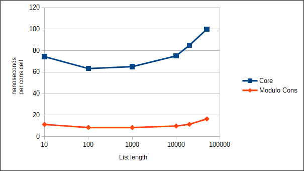

# A faster `List.map` for Elm

There's an old LISP trick from the 70's called ["tail recursion modulo cons"](https://en.wikipedia.org/wiki/Tail_call#Tail_recursion_modulo_cons) that allows you to optimise some linked-list functions that are "not quite" tail recursive. "Not quite" in this case means they do a "cons" before the tail call. The trick allows you to get around that and turn it into a while loop as the compiler does for proper tail recursive functions.

[jreusch mentioned this](https://discourse.elm-lang.org/t/elm-core-libs-in-webassembly/4443/11) to me once in the comments of a post about [my Elm in WebAssembly project](https://github.com/brian-carroll/elm_c_wasm/) over a year ago now.

Recently I was writing a function a bit like `List.map` as part of my project, remembered the comment, and tried out the technique. Then I got curious and decided to benchmark it against the [core List.map](https://package.elm-lang.org/packages/elm/core/latest/List#map) and see what happened. Well... good things happened!

| length | Core ns/cell | Modulo Cons ns/cell |
| ------ | ------------ | ------------------- |
| 10     | 74.5         | 11.3                |
| 100    | 63.3         | 8.5                 |
| 1000   | 65.1         | 8.4                 |
| 10000  | 75.2         | 9.8                 |
| 20000  | 85.0         | 11.4                |
| 50000  | 100.0        | 16.5                |



## Generality

I _think_ the optimisation should work for most of the core List functions that are currently based on `foldr`, which is quite a few of them:

- `List.map`
- `List.indexedMap`
- `List.filter`
- `List.append`
- `List.concat`
- `List.intersperse`
- `List.partition`
- `List.unzip`

However the `foldr` function itself seems to be too general. This optimisation relies on knowing the constructor for the return type.

`List.partition` and `List.unzip` each return a tuple of lists rather than a single list, but it should be easy to extend the optimisation to cover that case.

## Running the benchmark

Edit with the [Elm Benchmark](https://package.elm-lang.org/packages/elm-explorations/benchmark/latest) code till you're happy with it. Then do this:

```bash
elm make src/Main.elm --output dist/compiled.html
cp dist/compiled.html dist/modified.html
``` 

Now open modified.html in an editor and find this variable definition
```js
var $author$project$Main$moduloConsMap
```

Replace it with the code in src/modulo-cons-map.js

Load modified.html in a browser
